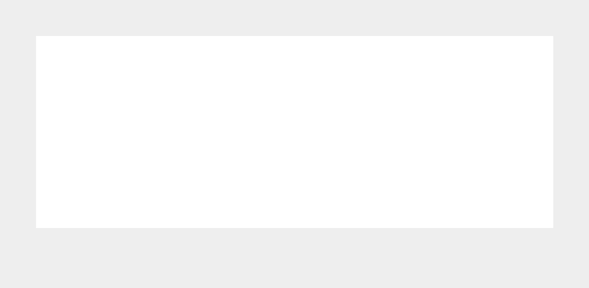

`Figure` is the canvas (SVG node) on which marks and axes are rendered. `Figure` extends [__DOMWidget__](https://ipywidgets.readthedocs.io/en/stable/examples/Widget%20Custom.html?highlight=DomWidget#DOMWidget,-ValueWidget-and-Widget), so it can be directly rendered in the output cell of the notebook. `Figure` contains the `axes`, `marks` and optionally `interaction` objects (selectors, pan-zoom etc.)

`Figure` API documentation can be accessed using the following links:

1. [Figure](../api/figure.md) class
2. [`figure`](../api/pyplot.md#bqplot.pyplot.figure) method in `pyplot`

In this section, we'll be focusing on pyplot API to create and configure `figure` objects.

Figure can be created in `pyplot` like so:

```py
import bqplot.pyplot as plt

fig = plt.figure()
```

### Attributes

#### [Style Attributes](/bqplot/api/figure/#bqplot.Figure--style-attributes)
Style attributes can be used for styling the figure (title, backgrounds, legends) etc.
#### [Layout Attributes](/bqplot/api/figure/#bqplot.Figure--layout-attributes)
Layout attributes can be used for controlling the dimensions and margins

### Code Examples
Let's look a few examples to configure the figure using the `pyplot` API:

#### Width And Height
Set the `height` and `width` of the figure by passing in a `layout` attribute like so:
```py
fig = plt.figure(layout=dict(height="500px", width="1000px"))
```

!!! warning
    Note that `width` and `height` have to be set in pixels (e.g. "500px" instead of 500)


One more approach is shown below:

```py
fig = plt.figure()

fig.layout.width = "1000px"
fig.layout.height = "500px"
```

#### Background Styling
Since bqplot figures are SVG nodes any CSS styles applicable to SVG can be passed as a `dict` to the `background_style` attribute, like so:

```
background_style = {"stroke": "blue",
                    "fill": "red",
                    "fill-opacity": .3}
fig = plt.figure(title="Figure", background_style=background_style)
fig
```

#### Figure Margin
Margins surrounding the figure can be set (during construction only) using the `fig_margin` attribute. Figure margins can be used to allow space for items like long tick labels, color bar (when using color scales) etc.

```py
fig_margin = dict(top=60, bottom=100, left=60, right=60) # (1)!
fig = plt.figure(fig_margin=fig_margin)
fig
```

1. Note that __all__ the four dimensions must be set in the dict



As you can see in the image above the grey region is the figure margin.


#### Interactions
Refer to the [Interaction](interactions/index.md) document for more details
