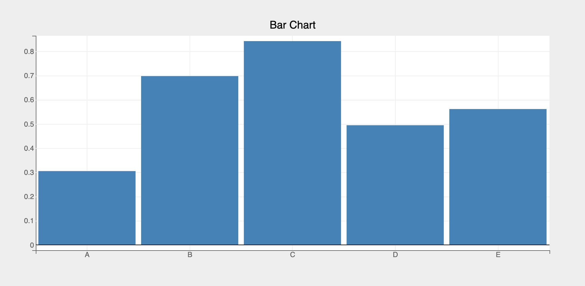
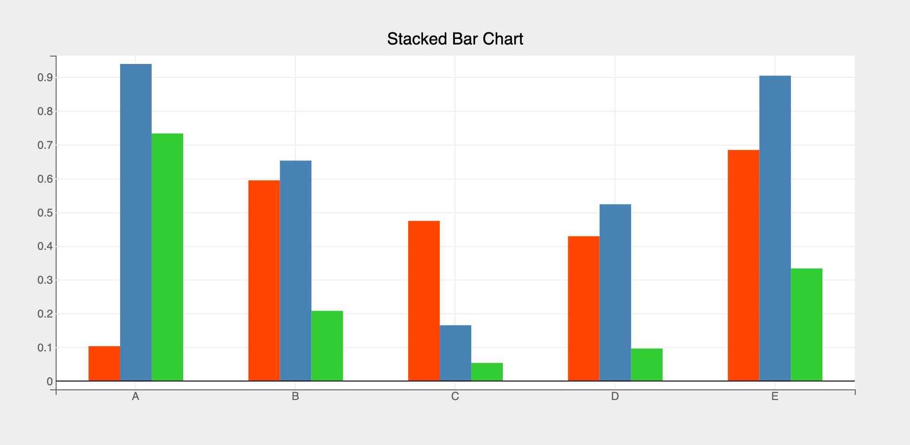

The `Bars` mark provides the following features:

* Plot a single or multiple arrays of y-values for a single array of __categorical__ x-values
* Support for horizontal bar charts
* Support for stacked and grouped bar charts

### Attributes

#### [Data Attributes](../../api/marks.md#bqplot.marks.Bars--data-attributes)

#### [Style Attributes](../../api/marks.md#bqplot.marks.Bars--style-attributes)


Let's now look at examples of constructing bar charts using the `pyplot` API

### pyplot
The function for plotting bar charts in `pyplot` is [`plt.bar`](../../api/pyplot.md#bqplot.pyplot.bar). It takes two main arguments:

1. __x__ vector of x values
2. __y__ vector of y values (_For stacked/grouped bar charts `y` should be a list of arrays or a 2-d array_)

For further customization, any of the attributes above can be passed as keyword args.

### Code Examples
#### Simple Bar Chart
```py hl_lines="9"
import bqplot.pyplot as plt
import numpy as np

fig = plt.figure(title="Bar Chart")

x = list("ABCDE")
y = np.random.rand(5)

bar = plt.bar(x, y)

fig
```

!!! tip
    To render bar charts professionally it's better to disable `x` grid lines. Also set the opacity to be slightly less than 1 to make the bars a bit transparent, like so:
    ```py
    axes_options = {"x": {"grid_lines": "none"}}
    bar = plt.bar(x, y, axes_options=axes_options, opacities=[.9])
    ```


Attributes can be updated in separate notebook cells or in callbacks when an event is triggered!
```py
# update the line color and opacity
bar.colors = ["red"]
bar.opacities = [.5]
```
#### Bar Spacing
Use the `padding` attribute (between 0 and 1) to increase or decrease the spacing between bars. 
`padding` values close to 0 means almost no padding between bars, thereby making the bars fat!

=== "During Construction"
    ```py
    bar = plt.bar(x, y, padding=0.3)
    ```

=== "Update After Construction"
    ```py
    bar.padding = 0.3
    ```

#### Horizontal Bar Chart
Use [`pyplot.barh`](../../api/pyplot.md#bqplot.pyplot.barh) method to create a horizontal bar chart, like so:

```py hl_lines="7"
fig = plt.figure(title="Horizontal Bar Chart")

x = list("ABCDE")
y = np.random.rand(5)

axes_options = {"x": {"grid_lines": "none"}}
bar = plt.barh(x, y, colors=["salmon"], axes_options=axes_options, opacities=[.9])

fig
```


#### Stacked/Grouped Bar Charts
Use the `type` attribute for stacked/grouped bar charts, like so:

=== "Stacked"

    ```py hl_lines="5"
    fig = plt.figure(title="Stacked Bar Chart")
    x = list("ABCDE")
    y = np.random.rand(3, 5) # 2d array

    stacked_bar = plt.bar(x, y, type="stacked", padding=.4,
                          colors=["orangered", "steelblue", "limegreen"])

    fig
    ```
    

=== "Grouped"

    ```py hl_lines="5"
    fig = plt.figure(title="Stacked Bar Chart")
    x = list("ABCDE")
    y = np.random.rand(3, 5) # 2d array

    grouped_bar = plt.bar(x, y, type="grouped", padding=.4,
                          colors=["orangered", "steelblue", "limegreen"])

    fig
    ```
    


#### Using `color` data attribute
Using `color` __data__ attribute we can encode a third dimension (apart from `x` and `y`) using color scales, like so:

```py hl_lines="3 4 10 12"
import bqplot as bq

# provide enough bottom margin to accommodate the color bar
fig = plt.figure(fig_margin = dict(top=50, bottom=80, left=50, right=50))

x = list("ABCDE")
y, color = np.random.rand(2, 5) 

# add a 'reds' scheme color scale
plt.scales(scales={"color": bq.ColorScale(scheme="Reds", min=0, max=1)})

bar = plt.bar(x, y, color=color, padding=0.2)

fig
```


### Example Notebooks
For detailed examples of plotting bar charts, refer to the following example notebooks:

1. [pyplot](https://github.com/bqplot/bqplot/blob/master/examples/Marks/Pyplot/Bars.ipynb)
2. [Object Model](https://github.com/bqplot/bqplot/blob/master/examples/Marks/Object%20Model/Bars.ipynb)