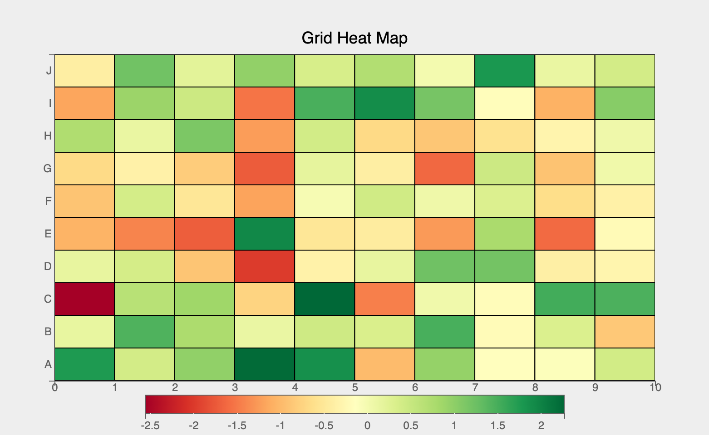
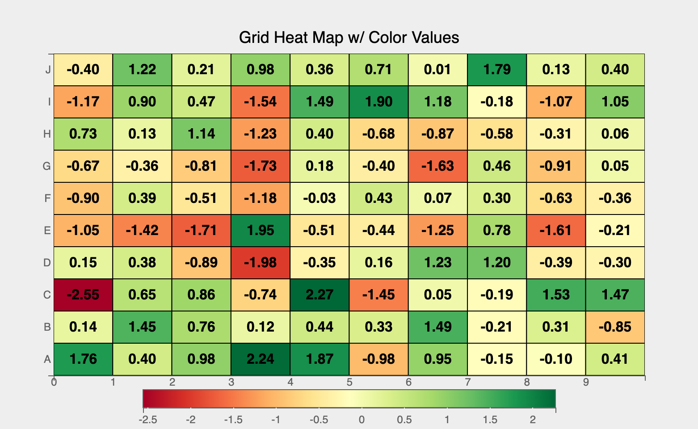
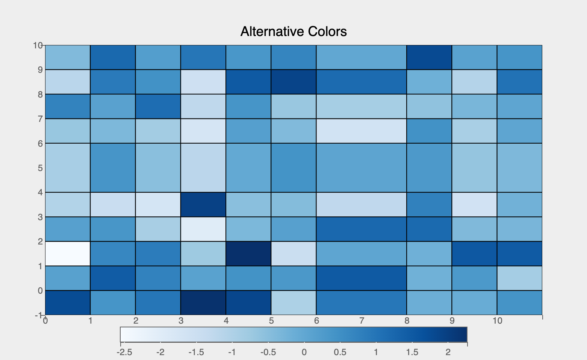

The `GridHeatMap` mark provides the following features:

* Plot a single 2d array of color values for a single array x-values and y-values

### Attributes

#### [Data Attributes](../../api/marks.md#bqplot.marks.GridHeatMap--data-attributes)

#### [Style Attributes](../../api/marks.md#bqplot.marks.GridHeatMap--style-attributes)


Let's now look at examples of constructing grid heat maps using the `pyplot` API

### pyplot
The function for plotting gridheatmap charts in `pyplot` is [`plt.gridheatmap`](../../api/pyplot.md#bqplot.pyplot.gridheatmap). It takes two main arguments:

1. __color__ vector of color values 
1. __row__ vector of labels for rows of the data
2. __column__ vector of labels for the columns of the data

For further customization, any of the attributes above can be passed as keyword args.

### Code Examples
#### Simple Grid Heat Map
```py hl_lines="9"
import bqplot.pyplot as plt
import numpy as np

data = np.random.randn(10, 10)
row = list("ABCDEFGHIJ")
column = np.arange(10)

fig = plt.figure(title="Grid Heat Map", padding_y=0)
grid_map = plt.gridheatmap(color=data, row=row, column=column)
fig
```

    
Attributes can be updated in separate notebook cells or in callbacks when an event is triggered!
```py
# update the line color and opacity
grid_map.opacity = 0.3
```

#### Cell Text Values
Often colors might obscure the values of each cell in the map. To avoid confusion, we can plot the explicit numeric values over each cell. Any CSS styles applicable to text can be passed as a `dict` to the `font_style` attribute to style the text.
    
=== "During Construction"
    ```py
    grid_map = plt.gridheatmap(
        color=data, 
        row=row, 
        column=column, 
        display_format=".2f",
        font_style={"font-size": "16px", "fill": "black", "font-weight": "bold"}
    )
    ```

=== "Update After Construction"
    ```py
    grid_map.display_format = ".2f"
    grid_map.font_style = {
        "font-size": "16px", 
        "fill": "black", 
        "font-weight": "bold"
    }
    ```


#### Non-Uniform Cells
Grid Heat Maps will adjust to any scalar non-uniform inputs in either the column or row arguments. For example, if we have an uneven grid where certain cells vary in size, Grid Heat Maps will reflect this size on the plot as shown below. 

```py
row = np.arange(10)
row[5:] = np.arange(6, 11)
column = np.arange(10)
column[7:] = np.arange(8, 11)

fig = plt.figure(title="Non-Uniform Cells",
                 padding_y=0)

grid_map = plt.gridheatmap(color=data, 
                           row=row, 
                           column=column)
fig
```


#### Alternative Color Schemes
By adjusting the scales for the color values used in the heatmap, we can change the plot to use any color scheme we desire. 
Using `color` __data__ attribute we can encode a third dimension (apart from `x` and `y`) using color scales, like so:

```py
import bqplot as bq

fig = plt.figure(title='Alternative Colors', padding_y=0)
grid_map = plt.gridheatmap(
    color=data, 
    row=row, 
    column=column,
    scales={"color": bq.ColorScale(scheme="Blues")}
)

fig
```


#### Interactions
##### Tooltips
Tooltips can be added by setting the `tooltip` attribute to a [Tooltip](../../api/tooltip.md) instance

```py
import bqplot as bq

row = list("ABCDEFGHIJ")
column = np.arange(10)
tooltip = bq.Tooltip(fields=["row", "column", "color"], 
                     formats=["", ".2f", ".2f"])

fig = plt.figure(title="Tooltip", padding_y=0.0)
grid_map = plt.gridheatmap(
    data,
    row=row,
    column=column,
    tooltip=tooltip
)
fig
```

##### Selecting Cells
Discrete cell(s) can be selected via mouse clicks. The `selected` attribute of the gridheatmap mark will be __automatically__ updated. Note that `selected` attribute is a `list` of __indices__ of the rows and columns for the selected cells!

!!! tip
    Use the `selected_style` and `unselected_style` attributes (which are dicts) to apply CSS styling for selected and un-selected cells respectively

Callbacks can be registered on changes to `selected` attribute. To select discrete set of cells set `interactions = {"click": "select"}`. Single cells can be selected by a mouse click. Mouse click + `command` key (mac) (or `control` key (windows)) lets you select multiple cells.
    ```py
    fig = plt.figure(title="Cell Selection", padding_y=0)
    row = list("ABCDEFGHIJ")
    column = np.arange(10)

    grid_map = plt.gridheatmap(
        data, 
        row=row, 
        column=column,
        interactions={"click": "select"},
        unselected_style={"opacity": "0.5"}
    )

    # callback to invoke when cells are selected
    def on_select(*args):
        selected_indices = grid_map.selected

        # do something with selected data
        print(selected_indices)

    # register callback on selected attribute
    grid_map.observe(on_select, names=["selected"])

    fig
    ```
    

### Example Notebooks
For detailed examples of gridheatmap plots, refer to the following example notebooks

1. [pyplot](https://github.com/bqplot/bqplot/blob/master/examples/Marks/Pyplot/GridHeatMap.ipynb)
2. [Object Model](https://github.com/bqplot/bqplot/blob/master/examples/Marks/Object%20Model/GridHeatMap.ipynb)