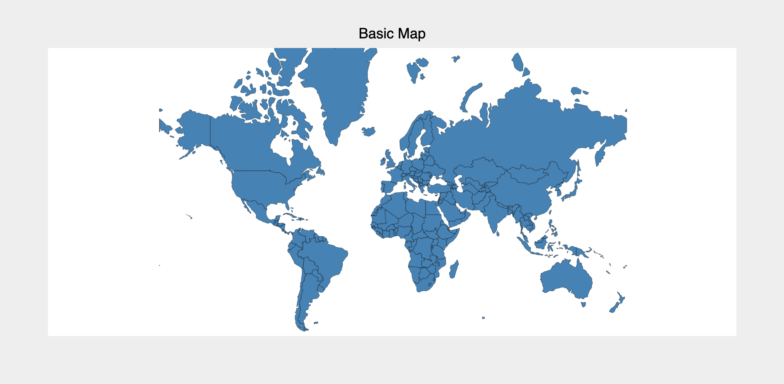
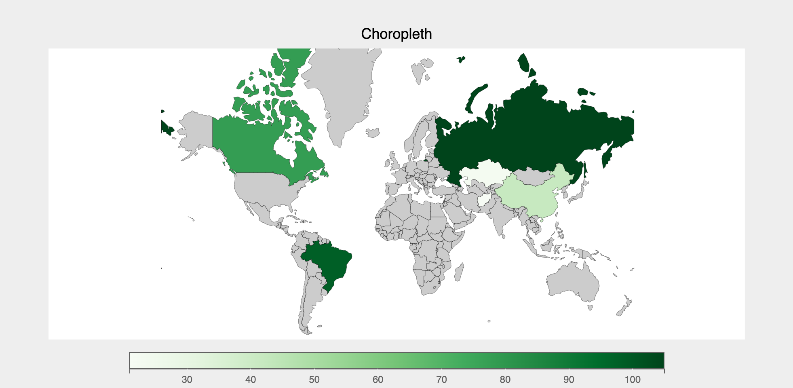
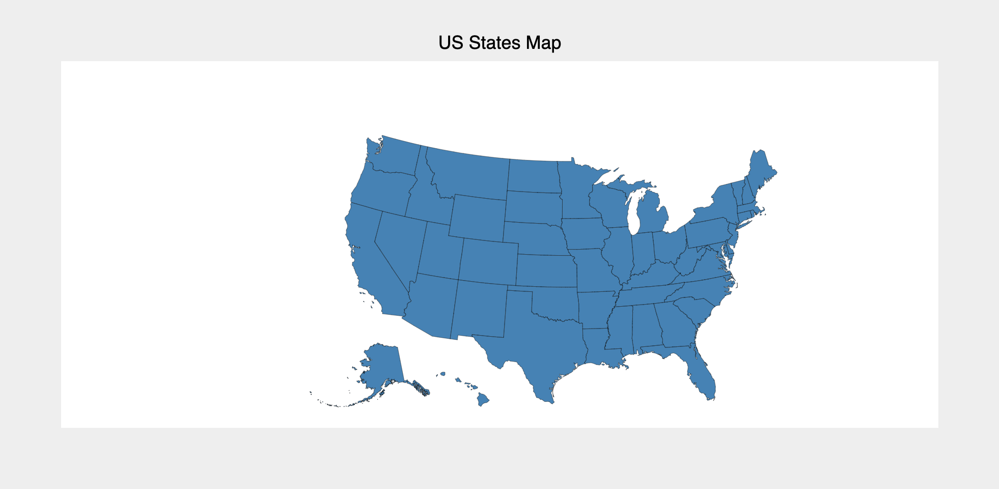
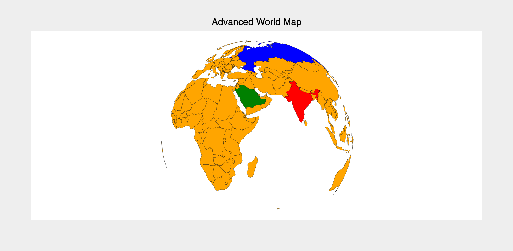

The `Map` mark provides the following features:

* Plot a geographical map using various [geo scales/projections](../../api/scales.md#bqscales.Orthographic)
* Use [ColorScale](../../api/scales.md#bqscales.ColorScale) to create choropleths
* Support interactions like tooltips, selections etc.

### Attributes

#### [Data Attributes](../../api/marks.md#bqplot.marks.Map--data-attributes)

#### [Style Attributes](../../api/marks.md#bqplot.marks.Map--style-attributes)


Let's look at examples of constructing maps using the `pyplot` API

### pyplot
The function for plotting bar charts in `pyplot` is [`plt.geo`](../../api/pyplot.md#bqplot.pyplot.geo). It takes one main argument:

1. __map_data__ Name of the map or json file required for the map data

Following map data are supported by default. For custom map data, a geo json file must be provided

| Map Data String| Description |
|---------------------|--------------------------|
| `WorldMap` | World Map  |
| `USStatesMap` | US States |
| `USCountiesMap` | US Counties |
| `EuropeMap` | Europe |

!!! tip
    Panzoom is enabled by default. Click and drag on the white region surrounding the map to pan and use the mouse to zoom in and out. Double click on the white region to reset the map.

### Code Examples
#### World Map
```py hl_lines="4 5"
import bqplot.pyplot as plt

fig = plt.figure(title="World Map")
plt.geo(map_data="WorldMap",
        colors={"default_color": "steelblue"})
fig
```
!!! Tip
    Style attribute `colors` represents color of the items of the map when no color data is passed. 
    The dictionary should be indexed by the __id of the element__ and have the corresponding colors as values.
    The key `default_color` controls the items for which no color is specified.



#### Choropleth
To render a choropleth, `color` data attribute needs to be passed. __Note that `color` must be a dictionary whose keys are element ids__

```py hl_lines="3 6"
fig = plt.figure(title="Choropleth")

plt.scales(scales={"color": bq.ColorScale(scheme="Greens")})
chloro_map = plt.geo(
    map_data="WorldMap",
    color={643: 105, 4: 21, 398: 23, 156: 42, 124: 78, 76: 98},
    colors={"default_color": "Grey"},
)
fig
```


#### US Map
```py hl_lines="2"
fig = plt.figure(title="US States Map")
plt.scales(scales={"projection": bq.AlbersUSA()})
states_map = plt.geo(map_data="USStatesMap", colors={"default_color": "steelblue"})
fig
```



#### Advanced Projections
Use [geo scale](../../api/scales.md#bqscales.Orthographic) to customize the projections, like so:

```py hl_lines="4 5"
import bqplot as bq

fig = plt.figure(title="Advanced World Map")
geo_scale = bq.Orthographic(scale_factor=375, center=[0, 25], rotate=(-50, 0))
plt.scales(scales={"projection": geo_scale})
map_mark = plt.geo(
    map_data="WorldMap",
    colors={682: "green", 356: "red", 643: "blue", "default_color": "orange"},
)
fig
```



#### Interactions
##### Tooltips
Tooltips can be added by setting the `tooltip` attribute to a [Tooltip](../../api/tooltip.md) instance

```py hl_lines="2 5"
fig = plt.figure(title="Interactions")
tooltip = bq.Tooltip(fields=["id", "name"])
map = plt.geo(
    map_data="WorldMap",
    tooltip=tooltip
)
fig
```

##### Selecting Map Element(s)
Map element(s) can be selected via mouse clicks. The `selected` attribute of the map mark will be __automatically__ updated. Note that `selected` attribute is a `list` of __ids__ of the selected elements.

!!! tip
    Use the `selected_style` and `unselected_style` attributes (which are dicts) to apply CSS styling for selected and un-selected elements respectively

Callbacks can be registered on changes to `selected` attribute.

To select elements set `interactions = {"click": "select"}`. Single element can be selected by a mouse click. Mouse click + `command` key (mac) (or `control` key (windows)) lets you select multiple elements.
```py hl_lines="6"
fig = plt.figure(title="World Map")
tooltip = bq.Tooltip(fields=["id", "name"])
map = plt.geo(
    map_data="WorldMap",
    tooltip=tooltip,
    interactions={"click": "select", "hover": "tooltip"}, # (1)!
)

# callback to invoke when elements are selected
def on_select(*args):
    selected_ids = map.selected
    if selected_ids is not None:
        # do something with selected elements
        print(selected_ids)

# register callback on selected attribute
map.observe(on_select, names=["selected"])

fig
```

1. We have enabled __both__ selections and tooltip here!

For an advanced example of maps and choropleths, checkout the [Wealth Of Nations Choropleth](https://github.com/bqplot/bqplot-gallery/blob/main/notebooks/wealth_of_nations/choropleth.ipynb) dashboard in [`bqplot-gallery`](https://github.com/bqplot/bqplot-gallery).

### Example Notebooks
For detailed examples of maps, refer to the following example notebooks

1. [pyplot](https://github.com/bqplot/bqplot/blob/master/examples/Marks/Pyplot/Map.ipynb)
2. [Object Model](https://github.com/bqplot/bqplot/blob/master/examples/Marks/Object%20Model/Map.ipynb)