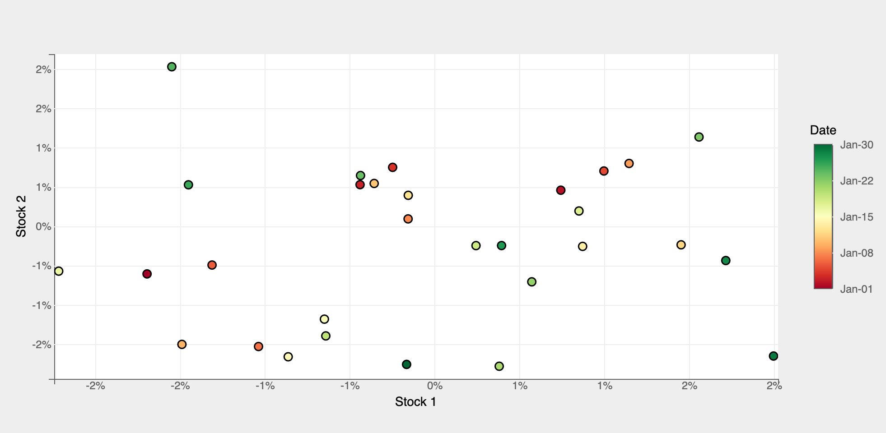

The Scatter mark provides the following features:

* Multi-dimensional scatter chart with with support for data attributes encoding `x`, `y`, `color`, `size` etc.
* Support for various marker types (circle, square, diamond etc.)
* Interactive updates with the ability to add new points by clicking on the chart, update points by moving the points etc.
* Filter data by using brush selectors

### Attributes

#### [Data Attributes](../../../api/marks/#bqplot.marks.Scatter--data-attributes)

#### [Style Attributes](../../../api/marks/#bqplot.marks.S--style-attributes)

### pyplot
The function for plotting scatter charts in `pyplot` is [`plt.scatter`](../../api/pyplot.md#bqplot.pyplot.scatter). It takes two main arguments:

1. __x__ 1d array of x values
2. __y__ 1d array of y values

For further customization, any of the data/style attributes above can be passed as keyword arguments.

### Code Examples
#### Simple Scatter Chart
```py hl_lines="7"
import bqplot.pyplot as plt
import numpy as np

fig = plt.figure()

x, y = np.random.rand(2, 20)
scatter = plt.scatter(x, y, stroke="black")
fig
```

!!! tip
    Adding a black stroke around the dots renders them well


Attributes can be updated in separate notebook cells or in callbacks when an event is triggered!
```py
scatter.marker = "cross" # (1)!
scatter.fill = False # (2)!
```

1. make the marker `cross`
2. no fill inside the marker
!!! tip "In Place Updates"
    The output cell containing the chart will be automatically updated whenever the figure or mark attributes are updated! The figure or marks should __never__ be recreated!

#### Labels
Labels for dots can be added by using the `names` attribute

```py hl_lines="5"
fig = plt.figure()

x, y = np.random.rand(2, 10)
names = [f"dot{i+1}" for i in range(10)]
line = plt.scatter(x, y, colors=["red"], names=names, apply_clip=False)
plt.show()

```

!!! tip
    Setting the [Mark](../../api/marks.md) style attribute `apply_clip` to `False` prevents labels from getting clipped off the figure


#### Multiple Dimensions
Multiple dimensions can be encoded in a scatter chart by using additional [data attributes](../../../api/marks/#bqplot.marks.Scatter--data-attributes) like `size`, `color` etc.

Below is an example of a scatter plot of returns (dummy data) of two stocks with color encoding the chronology

```py hl_lines="15 16 17 21"
import pandas as pd

# prepare dummy returns data for two stocks
import pandas as pd

# prepare dummy returns data for two stocks
dates = pd.date_range(start="2023-01-01", periods=30)
returns = np.random.randn(30, 2) * 0.01
df = pd.DataFrame(returns, index=dates, columns=["Stock1", "Stock2"])

dates, returns1, returns2 = df.index, df["Stock1"], df["Stock2"]

fig = plt.figure(fig_margin=dict(top=60, bottom=60, left=60, right=120)) # (1)!

axes_options = {
    "x": dict(label="Stock 1", tick_format=".0%"),
    "y": dict(label="Stock 2", tick_format=".0%"),
    "color": dict( # (2)!
        tick_format="%b-%d", num_ticks=5, label="Date",
        orientation="vertical", side="right"
    ),
}
scatter = plt.scatter(
    returns1, returns2, color=dates,
    stroke="black",
    axes_options=axes_options,
)
fig
```

1. Provide enough right margin to accommodate the color bar
2. Color bar attributes




### Example Notebooks
For detailed examples of scatter plots, refer to the following example notebooks

1. [pyplot](https://github.com/bqplot/bqplot/blob/master/examples/Marks/Pyplot/Scatter.ipynb)
2. [Object Model](https://github.com/bqplot/bqplot/blob/master/examples/Marks/Object%20Model/Scatter.ipynb)